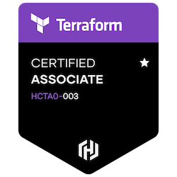
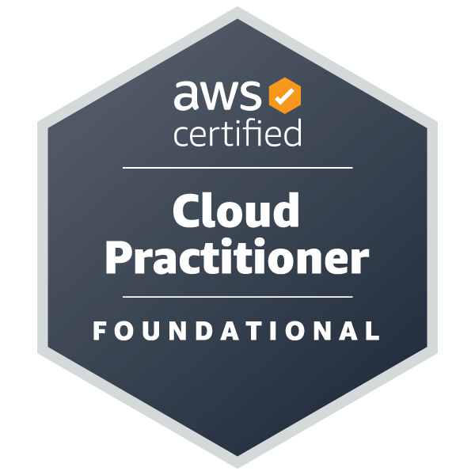

# About me

I'm a technical writer from Maryland who specializes in software documentation. When I'm not writing, I play video games, read, and bake a lot of banana bread.

## Work experience

- **[Workato](https://www.workato.com/) (2023-2024):** Senior Technical Writer
- **[Snyk](https://snyk.io/) (2022-2023):** Technical Writer
- **[Fugue](https://www.fugue.co/) (2015-2022):** Senior Technical Writer
- **[Carroll County Times](https://www.baltimoresun.com/carroll-county-times/) (2012-2015):** Night Editor
- **[Penny Publications](https://www.pennypublications.com/) (2008-2010):** Production Editor

## Education

- **Bachelor of Science, Mass Communications (Journalism track):** Towson University, 2008
- **Associate of Arts, Information Systems:** Montgomery College, 2020

## Certifications

[**HashiCorp Certified Terraform Associate (003)**](https://www.credly.com/badges/bca498e5-bcab-48a8-b1ce-1885bd3277f8/public_url)

[{: style="height:100px;width:100px"}](https://www.credly.com/badges/bca498e5-bcab-48a8-b1ce-1885bd3277f8/public_url)

[**AWS Certified Cloud Practitioner**](https://www.credly.com/badges/54dbf678-d16d-4a37-bf1c-2f6e379eea5a/public_url)

[{: style="height:100px;width:100px"}](https://www.credly.com/badges/54dbf678-d16d-4a37-bf1c-2f6e379eea5a/public_url)

## Organizations

- [**Society for Technical Communication**](https://www.stc.org/): Member (2022-current)