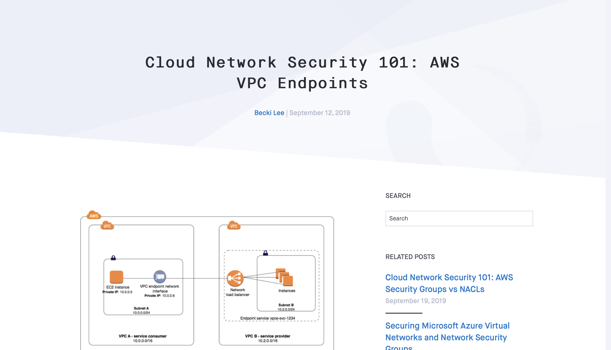

---
tags:
  - Blog post
  - Concept
  - Guide
  - Cloud security
---

# AWS VPC endpoints

:material-file-download-outline: [Best viewed as a PDF.](pdfs/blog-vpc-endpoints.pdf){ target="_blank" rel="noopener noreferrer" }

{ target="_blank" rel="noopener noreferrer" }

I wrote a **beginner's guide** to AWS Virtual Private Cloud (VPC) endpoints. To write it, I interviewed Fugue's director of security and extensively reviewed AWS's documentation. I then validated the information by deploying and testing infrastructure in my AWS account. The images are from AWS's docs.

This blog post performed very highly when it was published. For a long time, it was the first Google result for "vpc endpoints" after AWS's own documentation.

!!! abstract "Links"
    <ul class="star-list"><li class="star-bullet" title="Recommended view">[**PDF**](pdfs/blog-vpc-endpoints.pdf){ target="_blank" rel="noopener noreferrer" }: View a downloadable copy of the original document.</li>
    <li>[**Archived webpage**](https://web.archive.org/web/20201214155723/https://www.fugue.co/blog/network-security-vpc-endpoints-101){ target="_blank" rel="noopener noreferrer" }: View an archived copy of the document on the [Wayback Machine](https://archive.org/){ target="_blank" rel="noopener noreferrer" }.</li>
    <li>[**Live site**](https://www.fugue.co/blog/network-security-vpc-endpoints-101){ target="_blank" rel="noopener noreferrer" title="Recommended view" }: View the document on the live website. Note that I do not have control over the formatting or images.</li></ul>