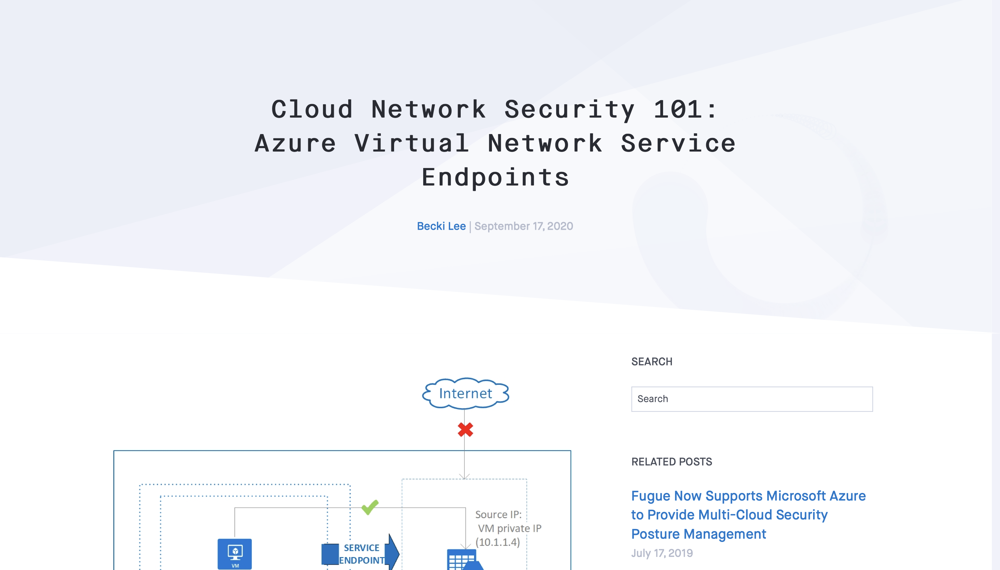

---
tags:
  - Blog post
  - Concept
  - Guide
  - Cloud security
---

# Azure Virtual Network blog post series

:material-file-download-outline: [Best viewed as a PDF.](pdfs/blog-azure-service-endpoints.pdf){ target="_blank" rel="noopener noreferrer" }

{ target="_blank" rel="noopener noreferrer" }

I wrote a **beginner's guide** to Azure Virtual Network (VNet) service endpoints and private endpoints. The series is composed of three blog posts:

- [Part 1](pdfs/blog-azure-service-endpoints.pdf){ target="_blank" rel="noopener noreferrer" }, shown above, is about Azure VNet service endpoints.
- [Part 2](pdfs/blog-azure-private-link-endpoints.pdf){ target="_blank" rel="noopener noreferrer" } is about Azure Private Link and private endpoints.
- [Part 3](pdfs/blog-azure-service-vs-private-endpoints.pdf){ target="_blank" rel="noopener noreferrer" } compares service endpoints and private endpoints.

To write these articles, I interviewed Fugue's director of security and extensively reviewed Azure's documentation. I then validated the information by deploying and testing infrastructure in my Azure subscription. The images are from Azure's docs.

The blog posts were originally published on Fugue's website, but were republished on the Cloud Security Alliance's blog as a series of guest posts.

!!! abstract "Links"
    <ul class="star-list"><li class="star-bullet" title="Recommended view">**PDF** ([Part 1](pdfs/blog-azure-service-endpoints.pdf){ target="_blank" rel="noopener noreferrer" }, [Part 2](pdfs/blog-azure-private-link-endpoints.pdf){ target="_blank" rel="noopener noreferrer" }, [Part 3](pdfs/blog-azure-service-vs-private-endpoints.pdf){ target="_blank" rel="noopener noreferrer" }): View a downloadable copy of each original document.</li>
    <li>**Archived webpage** ([Part 1](https://web.archive.org/web/20210127102711/https://www.fugue.co/blog/cloud-network-security-101-azure-virtual-network-service-endpoints){ target="_blank" rel="noopener noreferrer" }, [Part 2](https://web.archive.org/web/20210419072230/https://www.fugue.co/blog/cloud-network-security-101-azure-private-link-private-endpoints){ target="_blank" rel="noopener noreferrer" }, [Part 3](https://web.archive.org/web/20220129133834/https://www.fugue.co/blog/cloud-network-security-101-azure-service-endpoints-vs.-private-endpoints){ target="_blank" rel="noopener noreferrer" }): View an archived copy of each document on the [Wayback Machine](https://archive.org/){ target="_blank" rel="noopener noreferrer" }.</li>
    <li>**Live site** ([Part 1](https://cloudsecurityalliance.org/blog/2020/11/12/cloud-network-security-101-azure-virtual-network-service-endpoints){ target="_blank" rel="noopener noreferrer" }, [Part 2](https://cloudsecurityalliance.org/blog/2020/11/24/cloud-network-security-101-azure-private-link-private-endpoints){ target="_blank" rel="noopener noreferrer" }, [Part 3](https://cloudsecurityalliance.org/blog/2020/12/01/cloud-network-security-101-part-3-azure-service-endpoints-vs-private-endpoints){ target="_blank" rel="noopener noreferrer" }): View each document on the Cloud Security Alliance (CSA)'s blog. Note that I do not have control over the formatting or images.</li></ul>