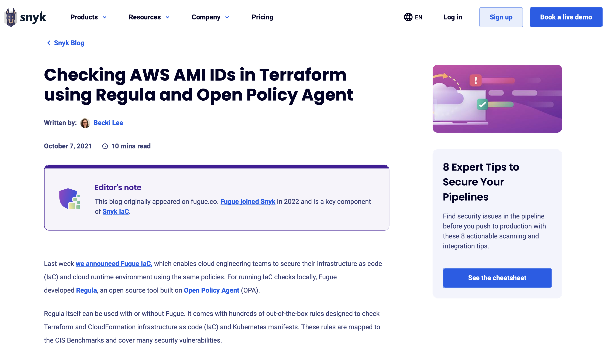

---
tags:
  - Blog post
  - Tutorial
  - Code samples
  - Rego
  - Policy-as-code
  - Infrastructure-as-code
---

# Checking AWS AMI IDs in Terraform using Regula and Open Policy Agent

:material-web: [Best viewed on the live website.](https://snyk.io/blog/checking-aws-ami-ids-in-terraform-using-regula-and-open-policy-agent/){ target="_blank" rel="noopener noreferrer" }

{ target="_blank" rel="noopener noreferrer" }

This **tutorial** blog post shows users how to check whether a HashiCorp Terraform configuration is compliant with Rego policy-as-code. In addition to writing the article, I wrote the Rego code and Terraform configuration and took the screenshots.

!!! abstract "Links"
    <ul class="star-list"><li>[**PDF**](pdfs/blog-checking-aws-amis-in-tf-with-regula.pdf){ target="_blank" rel="noopener noreferrer" }: View a downloadable copy of the original document.</li>
    <li>[**Archived webpage**](https://web.archive.org/web/20230705142139/https://snyk.io/blog/checking-aws-ami-ids-in-terraform-using-regula-and-open-policy-agent/){ target="_blank" rel="noopener noreferrer" }: View an archived copy of the document on the [Wayback Machine](https://archive.org/){ target="_blank" rel="noopener noreferrer" }.</li>
    <li class="star-bullet" title="Recommended view">[**Live site**](https://snyk.io/blog/checking-aws-ami-ids-in-terraform-using-regula-and-open-policy-agent/){ target="_blank" rel="noopener noreferrer" }: View the document on the live website.</li></ul>