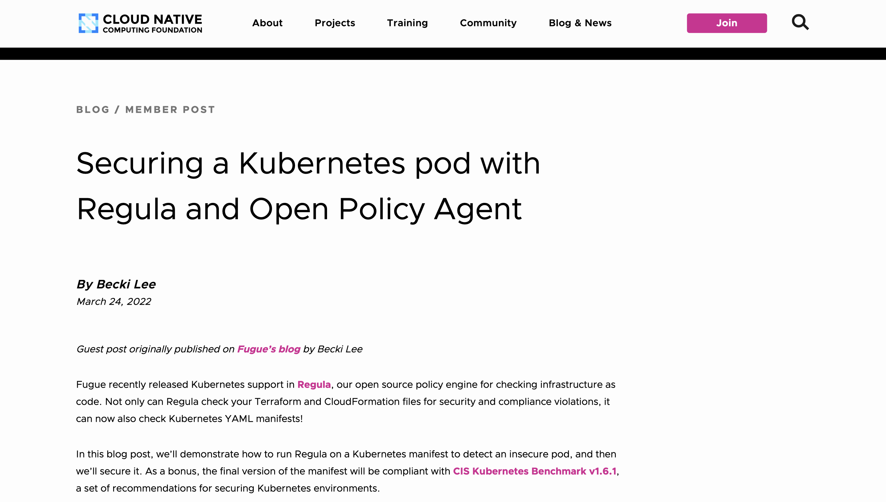

---
tags:
  - Blog post
  - Tutorial
  - Code samples
  - Rego
  - Policy-as-code
  - Kubernetes
---

# Securing a Kubernetes pod with Regula and OPA

:material-web: [Best viewed on the live website.](https://www.cncf.io/blog/2022/03/24/securing-a-kubernetes-pod-with-regula-and-open-policy-agent/){ target="_blank" rel="noopener noreferrer" }

{ target="_blank" rel="noopener noreferrer" }

This **tutorial** blog post shows how to use Regula to check whether a Kubernetes pod in a manifest is compliant with Rego policy-as-code. In addition to writing the article, I wrote the Rego code and Kubernetes manifest.

The blog post was originally posted on Fugue's website, but was republished on the [Cloud Native Computing Foundation's blog](https://www.cncf.io/blog/2022/03/24/securing-a-kubernetes-pod-with-regula-and-open-policy-agent/){ target="_blank" rel="noopener noreferrer" } as a guest post.

!!! abstract "Links"
    <ul class="star-list"><li>[**PDF**](pdfs/blog-regula-k8s.pdf){ target="_blank" rel="noopener noreferrer" }: View a downloadable copy of the original document.</li>
    <li>[**Archived webpage**](https://web.archive.org/web/20231002135547/https://www.cncf.io/blog/2022/03/24/securing-a-kubernetes-pod-with-regula-and-open-policy-agent/){ target="_blank" rel="noopener noreferrer" }: View an archived copy of the document on the [Wayback Machine](https://archive.org/){ target="_blank" rel="noopener noreferrer" }.</li>
    <li class="star-bullet" title="Recommended view">[**Live site**](https://www.cncf.io/blog/2022/03/24/securing-a-kubernetes-pod-with-regula-and-open-policy-agent/){ target="_blank" rel="noopener noreferrer" }: View the document on the live website.</li></ul>