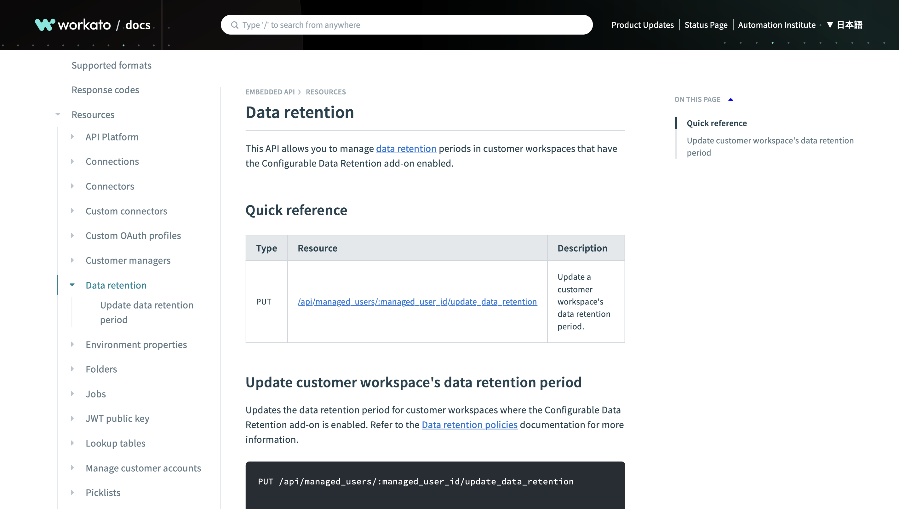

---
tags:
  - Documentation
  - API
  - Reference
  - Code samples
  - Enterprise automation
---

# Data retention API documentation

:material-web: [Best viewed on the live website.](https://docs.workato.com/oem/oem-api/data-retention.html){ target="_blank" rel="noopener noreferrer" }

{ target="_blank" rel="noopener noreferrer" }

I worked with a product manager to document this **API** endpoint for updating a Workato embedded account's data retention period. The product manager provided the endpoint URL and a sample request body, and I tested the endpoint to retrieve the output.

!!! abstract "Links"
    <ul class="star-list"><li>[**PDF**](pdfs/doc-embedded-api-data-retention.pdf){ target="_blank" rel="noopener noreferrer" }: View a downloadable copy of the original document.</li>
    <li>[**Archived webpage**](https://web.archive.org/web/20240501115106/https://docs.workato.com/oem/oem-api/data-retention.html){ target="_blank" rel="noopener noreferrer" }: View an archived copy of the document on the Wayback Machine.</li>
    <li class="star-bullet" title="Recommended view">[**Live site**](https://docs.workato.com/oem/oem-api/data-retention.html){ target="_blank" rel="noopener noreferrer" }: View the document on the live website. Note that the content may have been updated since I wrote it.</li></ul>