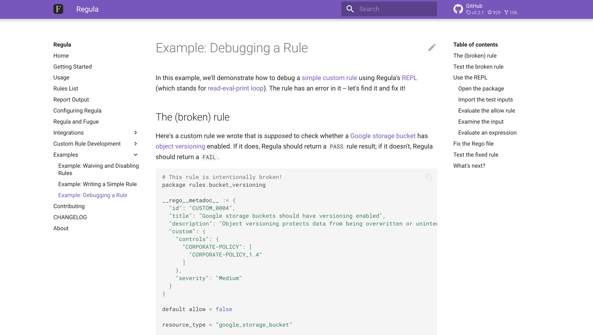

---
tags:
  - Documentation
  - Tutorial
  - Code samples
  - Rego
  - Policy-as-code
  - Infrastructure-as-code
---

# Example: Debugging a rule with Regula

[**Click the image to open the page in a new tab.**](https://regula.dev/examples/debug-tutorial.html){ target="_blank" rel="noopener noreferrer" }

{ target="_blank" rel="noopener noreferrer" }

This **tutorial** explains how to use Regula to debug a simple custom rule written in Rego. I wrote the Terraform configuration and the custom rule, consulted an engineer for details about using Regula's REPL, and then documented the process step by step.

!!! info
    You can view the [archived webpage](https://web.archive.org/web/20230331155831/https://regula.dev/examples/debug-tutorial.html){ target="_blank" rel="noopener noreferrer" } using the Wayback Machine or, if you prefer, download a [PDF](pdfs/doc-example-debugging-rule.pdf){ target="_blank" rel="noopener noreferrer" }.