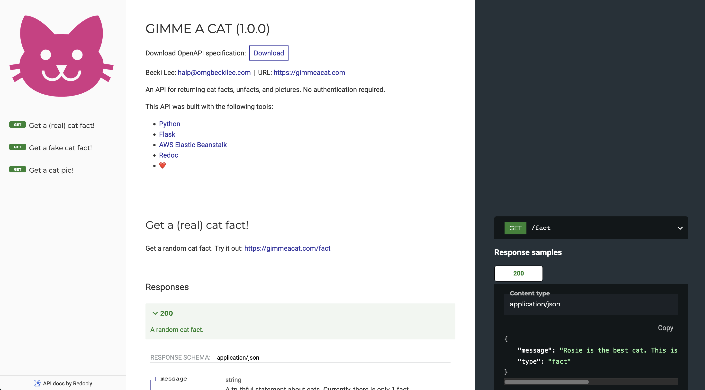

---
tags:
  - API
  - Code samples
  - Swagger
  - OpenAPI
---

# Example OpenAPI Documentation

:material-web: [Best viewed on the live website.](redoc-static.html){ target="_blank" rel="noopener noreferrer" }

{ target="_blank" rel="noopener noreferrer" }

I used [Redoc](https://redocly.com/redoc/){ target="_blank" rel="noopener noreferrer" } to generate this **API reference** from an OpenAPI specification. It documents the [gimmeacat.com](https://gimmeacat.com){ target="_blank" rel="noopener noreferrer" } API, which I created.

!!! abstract "Links"
    <ul class="star-list"><li>[**PDF**](pdfs/doc-openapi-example.pdf){ target="_blank" rel="noopener noreferrer"}: View a downloadable copy of the original document.</li>
    <li class="star-bullet" title="Recommended view">[**Live site**](redoc-static.html){ target="_blank" rel="noopener noreferrer" }: View the document on the live website.</li></ul>