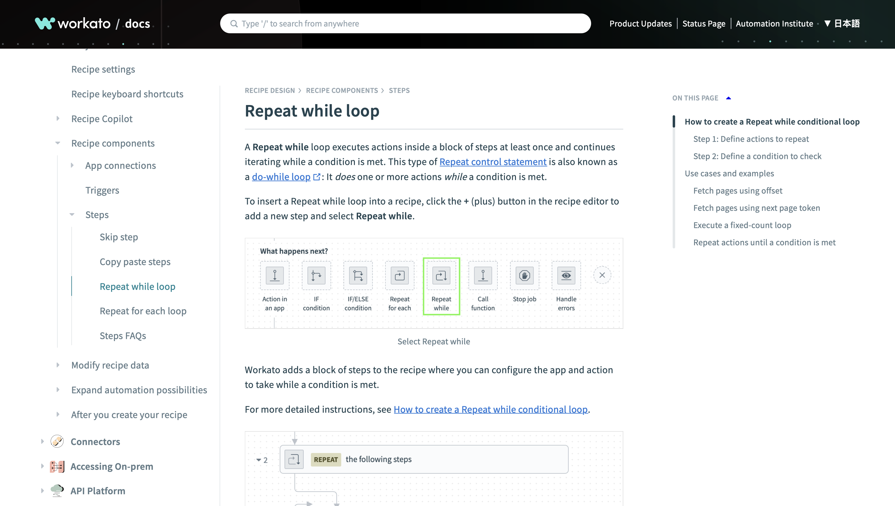

---
tags:
  - Documentation
  - Guide
  - Procedure
  - Concept
  - Enterprise automation
---

# Repeat while loop

:material-web: [Best viewed on the live website.](https://docs.workato.com/recipes/loops.html){ target="_blank" rel="noopener noreferrer" }

{ target="_blank" rel="noopener noreferrer" }

This **guide** describes Workato's repeat-while loop function. The document includes a conceptual overview, use cases, and detailed procedures. I spoke with a product manager and engineers to understand how the feature worked, and then I constructed the examples and took screenshots.

!!! abstract "Links"
    <ul class="star-list"><li>[**PDF**](pdfs/doc-repeat-while-loop.pdf){ target="_blank" rel="noopener noreferrer" }: View a downloadable copy of the original document.</li>
    <li>[**Archived webpage**](https://web.archive.org/web/20240424044638/https://docs.workato.com/recipes/loops.html){ target="_blank" rel="noopener noreferrer" }: View an archived copy of the document on the [Wayback Machine](https://archive.org/){ target="_blank" rel="noopener noreferrer" }.</li>
    <li class="star-bullet" title="Recommended view">[**Live site**](https://docs.workato.com/recipes/loops.html){ target="_blank" rel="noopener noreferrer" }: View the document on the live website. Note that the content may have been updated since I wrote it.</li></ul>