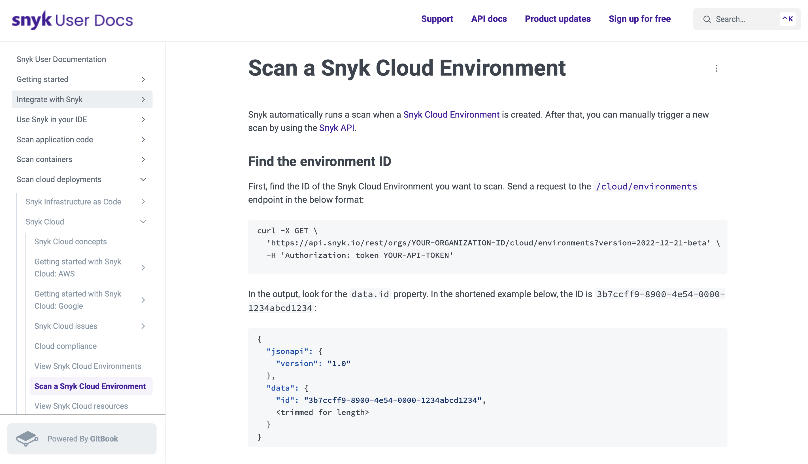

---
tags:
  - Documentation
  - Procedure
  - API
  - Code samples
  - Cloud security
---

# Scan a Snyk Cloud Environment

[**Click the image to open a PDF in a new tab.**](pdfs/doc-scan-snyk-cloud-env.pdf){ target="_blank" rel="noopener noreferrer" }

{ target="_blank" rel="noopener noreferrer" }

This **procedure** describes how to scan a Snyk Cloud Environment. To write it, I spoke with engineers and referred to our auto-generated API documentation. I then retrieved sample output by testing each command against my own Snyk Cloud Environments.

!!! info
    You can view the [archived webpage](https://web.archive.org/web/20230207043452/https://docs.snyk.io/scan-cloud-deployment/snyk-cloud/scan-a-snyk-cloud-environment){ target="_blank" rel="noopener noreferrer" } using the Wayback Machine.
