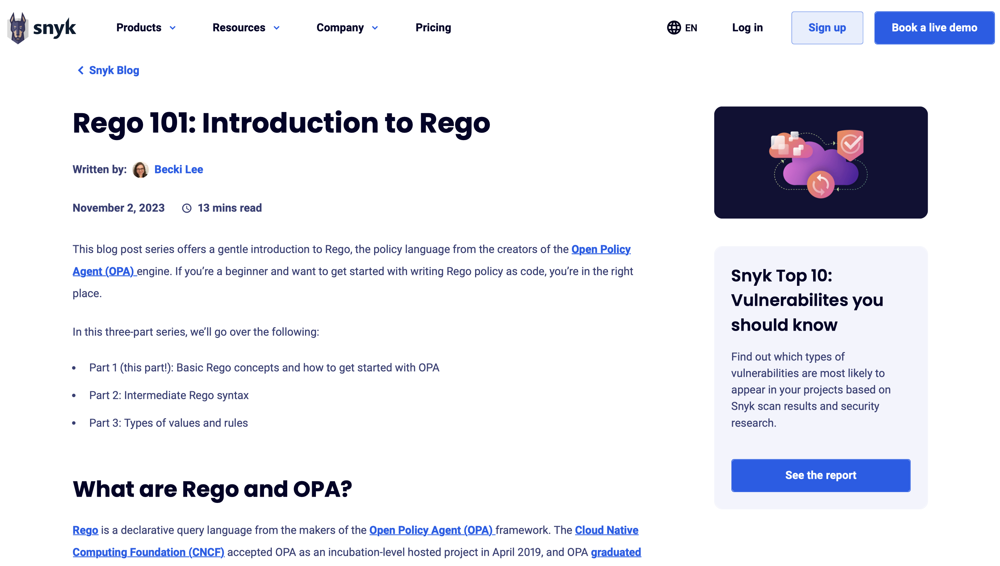
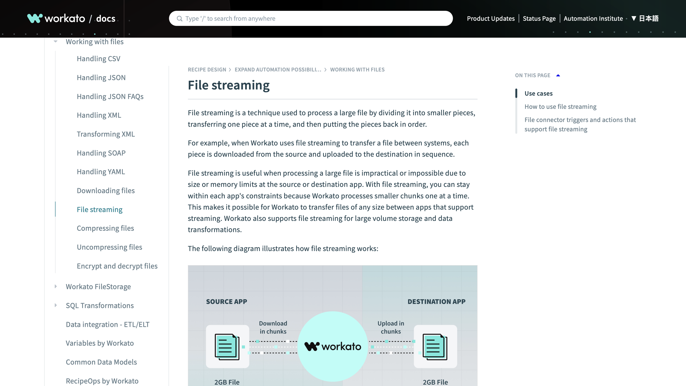
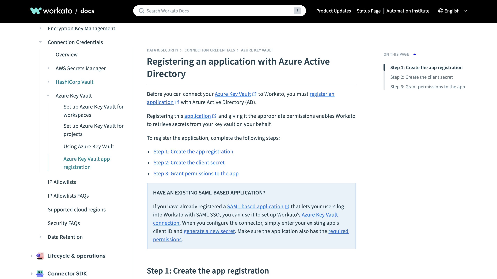
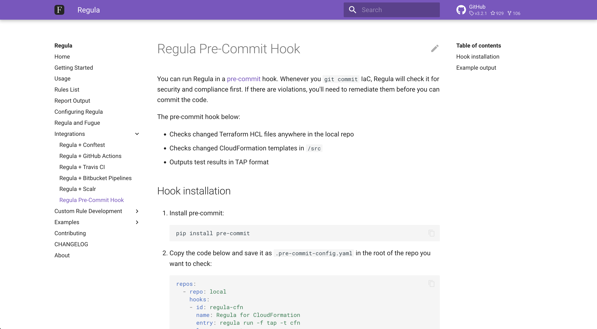

# BECKI LEE'S PORTFOLIO

## Highlights

I write documentation, blog posts, and occasionally code. Here are a few of my favorite clips:

- [**Rego 101: Introduction to Rego**](blog-rego-101.md) 

A **blog tutorial** about writing security rules in Rego, a policy-as-code language.
- [**File streaming guide**](doc-file-streaming.md) 

An **overview** of the file streaming feature in an enterprise automation product.
- [**Register an application with Azure AD**](doc-akv-app-registration.md) 

A **procedure** for creating an Azure AD app to support an Azure Key Vault integration.
- [**Regula pre-commit hook**](doc-regula-precommit-hook.md) 

A **procedure** for running a pre-commit hook to secure infrastructure-as-code.

## But wait, there's more!

You'll find a variety of writing samples in the side navigation. Each clip is also organized by [tag](tags.md).